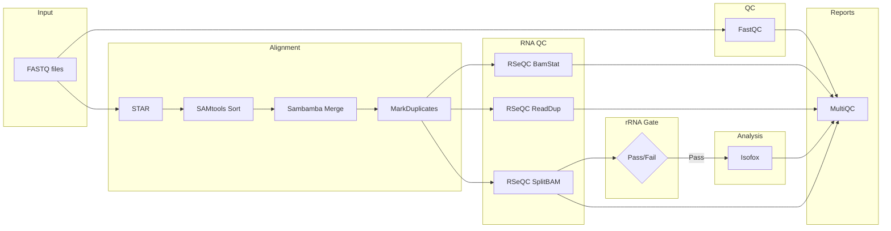

# nf-core/hmfrnaseq

[](https://github.com/nf-core/hmfrnaseq/actions/workflows/ci.yml)
[](https://github.com/nf-core/hmfrnaseq/actions/workflows/linting.yml)[](https://doi.org/10.5281/zenodo.XXXXXXX)
[](https://www.nf-test.com)

[](https://www.nextflow.io/)
[](https://docs.conda.io/en/latest/)
[](https://www.docker.com/)
[](https://sylabs.io/docs/)
[](https://cloud.seqera.io/launch?pipeline=https://github.com/nf-core/hmfrnaseq)

## Introduction

**nf-core/hmfrnaseq** is a bioinformatics pipeline for RNA-seq analysis integrating WiGiTS tools developed by the Hartwig Medical Foundation. It accepts paired-end Illumina FASTQ files or pre-aligned BAM files as input. The pipeline performs read alignment, quality control (including rRNA contamination checks), and uses Isofox for transcript quantification, alternative splicing detection, and fusion calling. Results are summarised in per-sample and aggregated MultiQC reports.



1. Read QC ([`FastQC`](https://www.bioinformatics.babraham.ac.uk/projects/fastqc/))
2. Alignment ([`STAR`](https://github.com/alexdobin/STAR))
3. BAM processing ([`SAMtools`](http://www.htslib.org/), [`Sambamba`](https://lomereiter.github.io/sambamba/))
4. Duplicate marking ([`GATK MarkDuplicates`](https://gatk.broadinstitute.org/))
5. RNA QC metrics ([`RSeQC`](http://rseqc.sourceforge.net/))
6. rRNA contamination check and filtering
7. Transcript quantification and fusion detection ([`Isofox`](https://github.com/hartwigmedical/hmftools/tree/master/isofox))
8. QC report ([`MultiQC`](http://multiqc.info/))

## Usage

> [!NOTE]
> If you are new to Nextflow and nf-core, please refer to [this page](https://nf-co.re/docs/usage/installation) on how to set-up Nextflow. Make sure to [test your setup](https://nf-co.re/docs/usage/introduction#how-to-run-a-pipeline) with `-profile test` before running the workflow on actual data.

First, prepare a samplesheet with your input data that looks as follows:

`samplesheet.csv`:

```csv
group_id,subject_id,sample_id,sample_type,sequence_type,filetype,info,filepath
SAMPLE1,SUBJECT1,SAMPLE1_T,tumor,rna,fastq,library_id:LIB001;lane:L001,/path/to/R1.fastq.gz;/path/to/R2.fastq.gz
```

Each row represents a pair of FASTQ files for one lane. For samples sequenced across multiple lanes, add one row per lane with the same identifiers.

Now, you can run the pipeline using:

```bash
nextflow run nf-core/hmfrnaseq \
   -profile <docker/singularity/.../institute> \
   --input samplesheet.csv \
   --outdir <OUTDIR> \
   --genome GRCh38_hmf
```

> [!WARNING]
> Please provide pipeline parameters via the CLI or Nextflow `-params-file` option. Custom config files including those provided by the `-c` Nextflow option can be used to provide any configuration _**except for parameters**_; see [docs](https://nf-co.re/docs/usage/getting_started/configuration#custom-configuration-files).

## Credits

nf-core/hmfrnaseq was originally written by Rayan Hassaine.

We thank the following people for their extensive assistance in the development of this pipeline:

<!-- TODO nf-core: If applicable, make list of people who have also contributed -->

## Contributions and Support

If you would like to contribute to this pipeline, please see the [contributing guidelines](.github/CONTRIBUTING.md).

## Citations

<!-- TODO nf-core: Add citation for pipeline after first release. Uncomment lines below and update Zenodo doi and badge at the top of this file. -->
<!-- If you use nf-core/hmfrnaseq for your analysis, please cite it using the following doi: [10.5281/zenodo.XXXXXX](https://doi.org/10.5281/zenodo.XXXXXX) -->

<!-- TODO nf-core: Add bibliography of tools and data used in your pipeline -->

An extensive list of references for the tools used by the pipeline can be found in the [`CITATIONS.md`](CITATIONS.md) file.

This pipeline uses code and infrastructure developed and maintained by the [nf-core](https://nf-co.re) community, reused here under the [MIT license](https://github.com/nf-core/tools/blob/main/LICENSE).

> **The nf-core framework for community-curated bioinformatics pipelines.**
>
> Philip Ewels, Alexander Peltzer, Sven Fillinger, Harshil Patel, Johannes Alneberg, Andreas Wilm, Maxime Ulysse Garcia, Paolo Di Tommaso & Sven Nahnsen.
>
> _Nat Biotechnol._ 2020 Feb 13. doi: [10.1038/s41587-020-0439-x](https://dx.doi.org/10.1038/s41587-020-0439-x).
