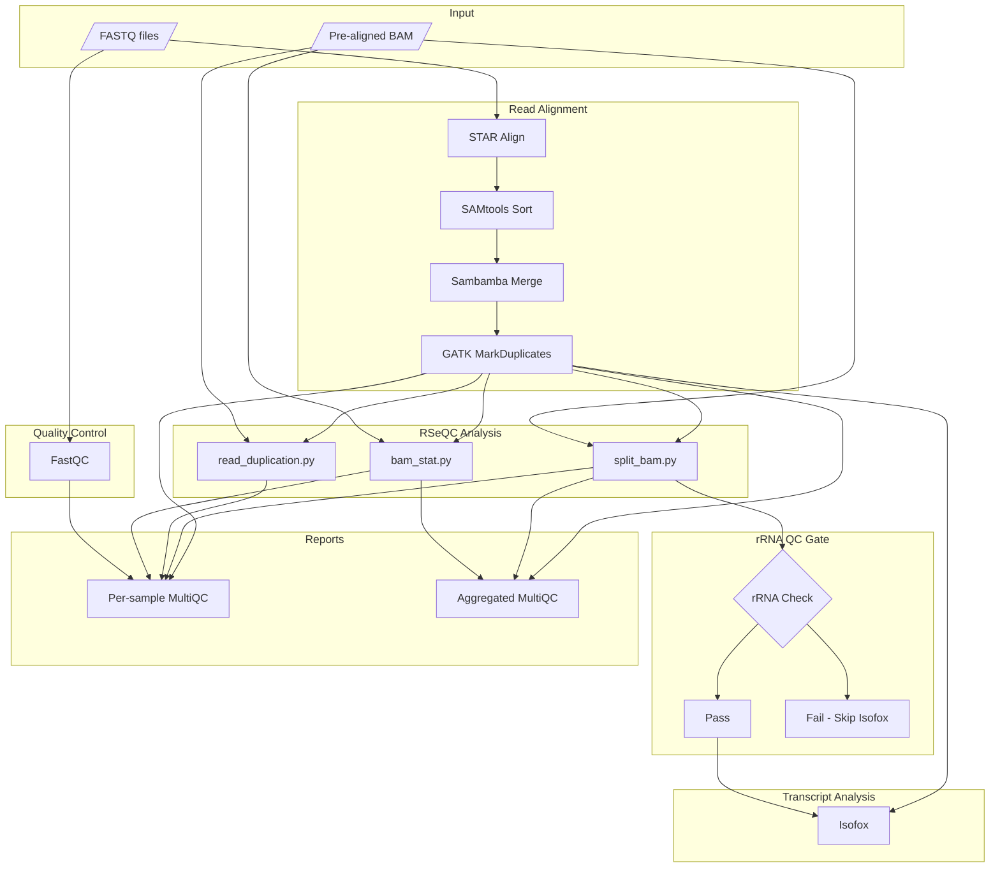
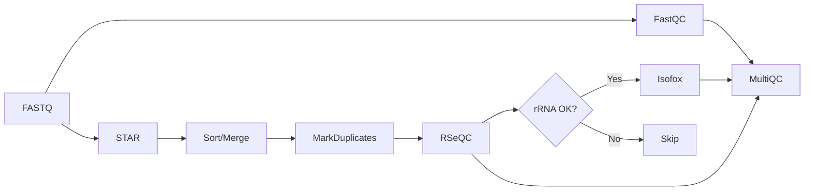

# nf-core/hmfrnaseq Pipeline Diagram

## Workflow Overview

## Simplified Linear View

## Process Labels

| Process | Label | Resources (Attempt 1) |
|---------|-------|----------------------|
| STAR_ALIGN | process_high | 12 CPU, 72GB |
| GATK4_MARKDUPLICATES | process_high | 12 CPU, 72GB |
| ISOFOX | process_high | 12 CPU, 72GB |
| RSEQC_* | process_high | 12 CPU, 72GB |
| FASTQC | process_medium | 6 CPU, 36GB |
| MULTIQC | process_single | 1 CPU, 6GB |
